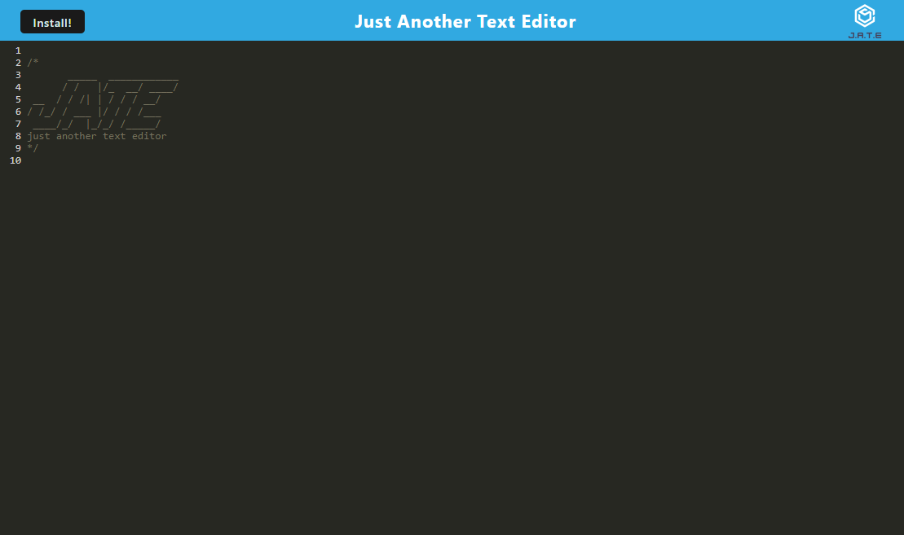

# Just Another Text Editor (JATE)

[](https://opensource.org/licenses/MIT)

  ---
  ## Description
This is a text editor that runs in a browser and  it features a number of data persistence techniques that serve as redundancy in case one of the options is not supported by the browser. The application is deployed on Heroku and also functions offline. It has the following interface:



[A deployed version can be viewed here.](https://howling-fangs-17072.herokuapp.com/)

See the application's GitHub repository [here.](https://github.com/jbtiglao/JATE)

  ---
  ## Table of Contents
  1. [Title](#title)
  2. [Description](#description)
  3. [Installation](#installation)
  4. [License](#license)
  5. [Contributing](#contributing)
  6. [Tests](#tests)
  7. [Author](#author)
  8. [Questions](#questions)
  
  ---
  ## Installation
  Clone my repository on GitHub.
  
  To install the application's `dependencies` and `devDependencies`, run:
  ```
  npm install
  ```
  
  To invoke the application, run:
  ```
  npm run start
  ```
  
  ---  
  ### Features and Functionalities
  
  This application is developed to allow users to create notes or code snippets with or without an internet connection, so users can reliably retrieve them for later use. It follows the features and functionalities required in the Assignment's README:
  
  1. When the user opens the application in the user's editor, the user will see a client server folder structure.
  
  2. When the user runs `npm run start` from the root directory, the application starts up the backend and serve the client.
  
  3. When the user runs the text editor application from my terminal, the user will find that the application's JavaScript files have been bundled using webpack.
  
  4. When the user runs the webpack plugins, the user will find a generated HTML file, service worker, and a manifest file.
  
  5. When the user uses next-gen JavaScript in the application, the text editor still functions in the browser without errors.
  
  6. When the user opens the text editor, the user will find the IndexedDB has immediately created a database storage.
  
  7. When the user enters content and subsequently clicks off of the DOM window, the content in the text editor is saved with IndexedDB.
  
  8. When the user reopens the text editor after closing it, the content in the text editor has been retrieved from the IndexedDB.
  
  9. When the user clicks on the Install button, the application is downloaded as an icon on the user's desktop.

  10. When the user loads the application, the user can register a service worker using workbox.

  11. When the user registers a service worker, the user's static assets are pre cached upon loading along with subsequent pages and static assets. 
  
  13. When the user deploys to Heroku, the user has a proper build scripts for a webpack application. 

  ---
  ## License
  MIT  
  ---
  ## Contributing
  To contribute to this application: 
  Please email the author for guidelines.

  ---
  ## Tests
  During development, the application is tested using `localhost`.

  ---

  ## Author
  Scott Wattenbarger

  ---
  ## Questions
  For questions or issues, please contact: 
  - Scott Wattenbarger
  - Email: scottwattenbarger@gmail.com
  - GitHub Username: scottwatt
  - GitHub Profile: https://github.com/scottwatt
